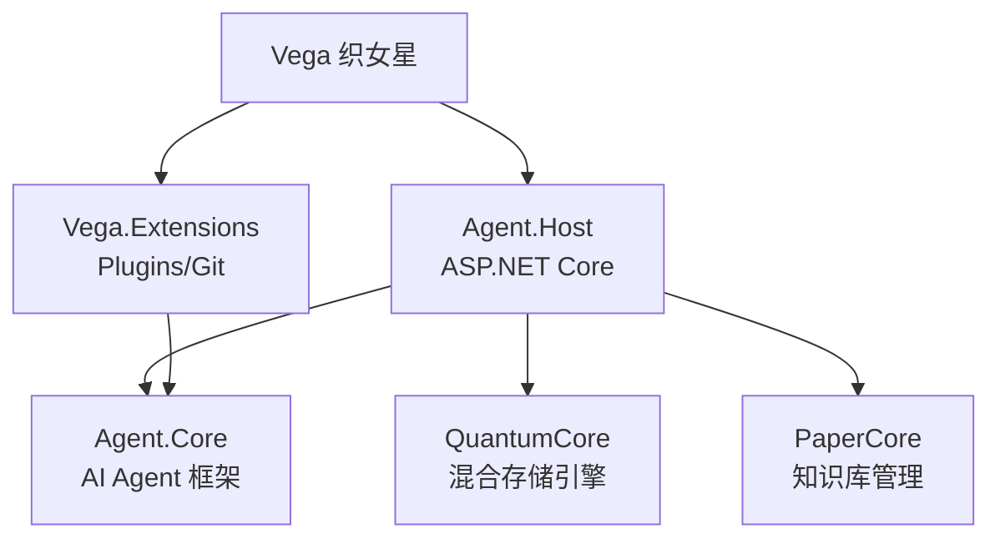

# Ignorant Vega（织女星）

> Ignorant 恒星系列 · 轻松管理 Windows 设备

> 让技术隐于无形，你需要时它已在

Windows 个人电脑管家 + 轻型编程助手，基于 .NET 10 和 MiMo LLM。

## 📁 项目结构

```
Ignorant Vega/
├── 📄 项目文档
│   ├── README.md                    # 项目主文档 (本文档)
│   ├── LICENSE                      # MIT 许可证
│   ├── PLAN.md                      # 分步实施计划 (16个Phase)
│   ├── TECH_DEBT.md                 # 技术债务清单
│   └── mimo.md                      # MiMo API 接口文档
│
├── 🚀 启动脚本
│   ├── start.cmd / start.ps1        # Host 启动脚本
│   ├── tui.cmd / tui.ps1            # TUI 终端界面
│   ├── gui.cmd / gui.ps1            # GUI 桌面控制台
│   ├── launcher.cmd                 # WinForm 启动器
│   ├── bootstrap-sdk.ps1            # .NET SDK 引导下载
│   └── webview-bootstrap.ps1        # WebView2 引导安装
│
├── ⚙️ 解决方案
│   ├── Agent.slnx                   # .NET 解决方案
│   └── Directory.Build.props        # MSBuild 全局属性
│
├── 📂 源代码
│   ├── src/
│   │   ├── Vega.Extensions/         # Vega 独有扩展 (Plugins/Git/PluginTools)
│   │   ├── Agent.Host/              # ASP.NET Core 主机 (API + 端点)
│   │   ├── Agent.GUI/               # WPF 桌面控制台 (WebView2)
│   │   ├── Agent.TUI/               # Terminal.Gui 终端界面
│   │   ├── Agent.Launcher/          # WinForm 启动器
│   │   └── Agent.CLI/               # PowerShell CLI 模块
│   └── tests/
│       └── Agent.Core.Tests/        # 单元测试 (231个)
│
├── 🔧 工具与插件
│   ├── tools/
│   │   ├── scripts/                 # PowerShell 脚本工具
│   │   └── dotnet-script/           # C# 单文件工具
│   └── plugins/
│       ├── system-dashboard/        # 系统仪表盘
│       └── quick-commands/          # 快捷命令
│
└── 📊 数据与配置
    └── data/
        ├── config/                  # agent.md / memory.md / user.md
        └── security/                # 安全白名单
```

## 🧩 三大开源组件

Vega 基于三个独立开源库构建：

| 组件 | 仓库 | 职责 |
|------|------|------|
| **Agent.Core** | [Ignorant.Core](https://github.com/BestLovelyGod/Ignorant.Core) | AI Agent 框架 — LLM 连接、工具系统、Agent Loop、安全策略 |
| **QuantumCore** | [Science/QuantumCore](https://github.com/BestLovelyGod/QuantumCore) | 嵌入式混合存储引擎 — Redis 风格 KV + WAL 崩溃恢复 |
| **PaperCore** | [Science/PaperCore](https://github.com/BestLovelyGod/PaperCore) | 知识库管理 — Markdown 存储 + REST API + 全文搜索 |



## 🚀 快速开始

### 前置条件

- Windows 10/11
- .NET 10 SDK（首次运行自动下载）

### 启动服务

```powershell
# 1. 配置 API Key
Copy-Item data\llm-config.json.example data\llm-config.json
# 编辑 data\llm-config.json，填入你的 MiMo API Key

# 2. 启动服务
.\start.cmd
```

### API 端点

| 端点 | 说明 |
|------|------|
| `GET /health` | 健康检查 |
| `POST /v1/chat/completions` | OpenAI 兼容聊天 API |
| `GET /api/tools` | 已注册工具列表 |
| `GET /api/sessions` | 会话管理 |
| `POST /api/knowledge` | 知识库（PaperCore） |
| `GET /api/plugins` | 插件管理 |
| `GET /swagger` | API 文档 |

## 📄 许可证

[GNU General Public License v3.0](LICENSE)
│   ├── Agent.Host/                # 运行时文件
│   ├── Agent.TUI/                 # TUI 运行时
│   ├── Agent.GUI/                 # GUI 运行时
│   ├── Agent.Launcher/            # 启动器运行时
│   ├── data/                      # 配置文件 (ApiKey 已清除)
│   ├── tools/                     # 内置工具
│   ├── plugins/                   # 插件
│   ├── Agent.Host/sdk/            # 内置 .NET SDK
│   ├── start.cmd                  # Host 启动脚本
│   ├── start.ps1                  # Host PowerShell 脚本
│   ├── tui.cmd                    # TUI 启动脚本
│   ├── tui.ps1                    # TUI PowerShell 脚本
│   ├── gui.cmd                    # GUI 启动脚本
│   ├── gui.ps1                    # GUI PowerShell 脚本
│   ├── launcher.cmd               # 启动器脚本 (管理员权限)
│   ├── bootstrap-sdk.ps1          # SDK 引导脚本
│   ├── webview-bootstrap.ps1      # WebView2 引导脚本
│   ├── README.md                  # 项目文档
│   └── VERSION.txt                # 版本信息
└── IgnorantVega-v1.1.0-win-x64.zip  # 7z 压缩包
```

### 部署步骤

1. **解压发布包**

   ```powershell
   # Windows 11 自带 7z 解压支持，或使用任意解压工具
   Expand-Archive IgnorantVega-v1.1.0-win-x64.zip -DestinationPath C:\IgnorantVega
   ```
2. **启动服务** (四种模式任选)

   ```powershell
   cd C:\IgnorantVega
   .\launcher.cmd   # WinForm 启动器 (推荐，图形化管理所有服务)
   .\gui.cmd        # GUI 桌面控制台
   .\start.cmd      # Host Web API 服务
   .\tui.cmd        # TUI 终端界面
   ```
3. **首次运行**
   首次运行会自动下载 .NET SDK（约 300MB）和安装 WebView2 Runtime（GUI 模式），请确保网络连接正常。启动器会引导完成所有环境安装，API Key 通过启动器设置界面或 GUI 设置页面配置。

### 启动脚本说明

| 脚本                          | 用途                                                     |
| ----------------------------- | -------------------------------------------------------- |
| `gui.cmd` / `gui.ps1`     | 启动 GUI 桌面控制台（优先用内置 SDK，无需 .NET Runtime） |
| `start.cmd` / `start.ps1` | 启动 Agent Host 服务                                     |
| `tui.cmd` / `tui.ps1`     | 启动 TUI 终端界面                                        |
| `launcher.cmd`              | 启动 WinForm 启动器（自包含 EXE，管理员权限）            |
| `bootstrap-sdk.ps1`         | 引导下载 .NET SDK（首次运行自动调用）                    |
| `webview-bootstrap.ps1`     | 引导安装 WebView2 Runtime（GUI 模式自动调用）            |

### 启动参数

**start.ps1 参数：**

| 参数             | 类型   | 默认值     | 说明                            |
| ---------------- | ------ | ---------- | ------------------------------- |
| `-ApiKey`      | String | -          | API 密钥（优先于配置文件）      |
| `-Port`        | Int    | `7300`   | 服务端口                        |
| `-OpenBrowser` | Switch | `$false` | 启动后自动打开浏览器            |
| `-Dev`         | Switch | `$false` | 开发模式（使用 `dotnet run`） |

**tui.ps1 参数：**

| 参数         | 类型   | 默认值                    | 说明                |
| ------------ | ------ | ------------------------- | ------------------- |
| `-HostUrl` | String | `http://localhost:7300` | Agent Host 服务地址 |

## 📡 API 端点

### 系统

| 端点        | 方法 | 说明     |
| ----------- | ---- | -------- |
| `/health` | GET  | 健康检查 |

### 工具管理

| 端点                          | 方法 | 说明             |
| ----------------------------- | ---- | ---------------- |
| `/api/tools`                | GET  | 列出所有可用工具 |
| `/api/tools/{name}`         | GET  | 获取工具详情     |
| `/api/tools/{name}/execute` | POST | 执行工具         |

### 任务管理

| 端点                       | 方法   | 说明             |
| -------------------------- | ------ | ---------------- |
| `/api/tasks`             | POST   | 提交新任务       |
| `/api/tasks`             | GET    | 列出所有任务     |
| `/api/tasks/{id}`        | GET    | 获取任务详情     |
| `/api/tasks/{id}`        | DELETE | 删除任务         |
| `/api/tasks/{id}/stream` | GET    | SSE 流式任务状态 |

### 审计与审阅

| 端点                          | 方法 | 说明     |
| ----------------------------- | ---- | -------- |
| `/api/audit`                | GET  | 审计日志 |
| `/api/reviews`              | GET  | 审阅列表 |
| `/api/reviews/{id}/approve` | POST | 批准审阅 |
| `/api/reviews/{id}/reject`  | POST | 拒绝审阅 |

### 插件管理

| 端点                       | 方法 | 说明         |
| -------------------------- | ---- | ------------ |
| `/api/plugins`           | GET  | 插件列表     |
| `/api/plugins/{name}`    | GET  | 获取插件详情 |
| `/api/plugins/reload`    | POST | 重新加载插件 |
| `/api/plugins/directory` | GET  | 获取插件目录 |

### 提示词管理

| 端点                    | 方法    | 说明                |
| ----------------------- | ------- | ------------------- |
| `/api/prompt`         | GET     | 查看完整提示词      |
| `/api/prompt/summary` | GET     | 查看提示词摘要      |
| `/api/prompt/agent`   | GET/PUT | 查看/更新 agent.md  |
| `/api/prompt/memory`  | GET/PUT | 查看/更新 memory.md |

### 配置管理

| 端点                   | 方法 | 说明                |
| ---------------------- | ---- | ------------------- |
| `/api/config`        | GET  | 获取配置            |
| `/api/config/apikey` | GET  | 获取 API Key (脱敏) |
| `/api/config/apikey` | PUT  | 更新 API Key        |

### 浏览器扩展

| 端点                                      | 方法 | 说明               |
| ----------------------------------------- | ---- | ------------------ |
| `/api/browser/command`                  | POST | 发送浏览器扩展命令 |
| `/api/browser/pending`                  | GET  | 获取待处理命令     |
| `/api/browser/response`                 | POST | 浏览器响应结果     |
| `/api/browser/status`                   | GET  | 浏览器扩展状态     |
| `/api/browser/tabs`                     | GET  | 浏览器标签页列表   |
| `/api/browser/network-request`          | POST | 记录网络请求       |
| `/api/browser/network-requests/{tabId}` | GET  | 获取标签页网络请求 |

### OpenAI 兼容

| 端点                              | 方法   | 说明            |
| --------------------------------- | ------ | --------------- |
| `/v1/models`                    | GET    | 模型列表        |
| `/v1/chat/completions`          | POST   | OpenAI 兼容聊天 |
| `/v1/conversations/{sessionId}` | DELETE | 删除会话        |

### 系统仪表盘 (插件)

| 端点                         | 方法 | 说明     |
| ---------------------------- | ---- | -------- |
| `/api/dashboard/overview`  | GET  | 系统概览 |
| `/api/dashboard/memory`    | GET  | 内存详情 |
| `/api/dashboard/processes` | GET  | 进程列表 |

## 🔧 内置工具 (Token 优化: 组工具 + 独立工具)

### L0: 组工具 (合并多个工具为一个 schema, 渐进式披露)

| 工具           | 子功能                                                                                                                                       |
| -------------- | -------------------------------------------------------------------------------------------------------------------------------------------- |
| `system-ops` | info(系统信息) / process(进程) / performance(性能) / events(事件日志) / service(服务) / task(计划任务) / registry(注册表) / ivega(IVega账户) |
| `file-ops`   | find(搜索) / clean(清理) / sync(同步) / acl(权限) / hash(哈希)                                                                               |
| `net-ops`    | test(诊断) / search(搜索) / api(HTTP请求) / adapter(适配器)                                                                                  |
| `auto-ops`   | notify(通知) / convert(格式转换)                                                                                                             |
| `sdk-ops`    | compile(编译C#) / nuget-search(搜索包) / nuget-list(已装包) / run(运行程序)                                                                  |
| `plugin-ops` | create(创建插件) / list(插件列表) / reload(重载插件)                                                                                         |

### L0: 独立工具

| 工具            | 说明                                                       |
| --------------- | ---------------------------------------------------------- |
| `powershell`  | 执行 PowerShell 命令 (通用入口)                            |
| `save-memory` | 将用户要求记住的内容写入长期记忆                           |
| `browser`     | 浏览器自动化 (通过 Edge 扩展, 支持 Cookie/多标签/网络监控) |
| `downloader`  | 文件下载 (支持 HTTP/FTP/磁力链接, 多线程)                  |
| `archive`     | 压缩解压 (支持 7z/zip/tar, 加密)                           |
| `run-process` | 运行外部进程 (支持中文应用名)                              |

### L1: PowerShell 脚本工具

| 目录            | 脚本                                                                                                                                            |
| --------------- | ----------------------------------------------------------------------------------------------------------------------------------------------- |
| `system/`     | Get-SystemInfo, Get-ProcessReport, Get-Performance, Get-EventLogReport, Manage-Service, Manage-ScheduledTask, Manage-Registry, Create-IVegaUser |
| `filesystem/` | Find-Files, Clean-TempFiles, Sync-Folders, Manage-ACL, Get-FileHashReport                                                                       |
| `network/`    | Test-Network, Search-Web, Invoke-ApiCall, Get-NetworkAdapter, Get-Weather                                                                       |
| `automation/` | Send-Notification, Convert-Data                                                                                                                 |

### L2: C# 单文件工具

| 工具                | 说明                                   |
| ------------------- | -------------------------------------- |
| `HashGenerator`   | 哈希生成 (MD5/SHA1/SHA256/SHA512)      |
| `JsonTransformer` | JSON 转换 (格式化/过滤/合并)           |
| `RestClient`      | HTTP REST 客户端                       |
| `SearchWeb`       | 联网搜索 (必应/百度, C# 版)            |
| `CreateIVegaUser` | IVega 账户管理 (C# 版, 自动提权)       |
| `EdgeBrowser`     | Edge 浏览器自动化 (CDP 协议, 基础模式) |

### 💬 提示词架构

LLM 收到两条消息：

| 消息角色            | 内容                                        | 用户可见        |
| ------------------- | ------------------------------------------- | --------------- |
| **Developer** | 核心安全规则 + 工具使用指南 + 自动记忆规则  | ❌ 硬编码不可见 |
| **System**    | agent.md + memory.md + user.md + 动态上下文 | ✅ 用户自由编辑 |

- **Developer** 保安全底线（必须 function calling、搜索限制、执行操作规则），用户永远看不到
- **System** 完全由用户掌控，删空了也没关系，`DefaultPrompts` 自动恢复初始模板
- 两层独立，不是覆盖关系

### 🧠 记忆管理

| 机制     | 说明                                                      |
| -------- | --------------------------------------------------------- |
| 自动保存 | 用户说 "记住X" → LLM 调用 `save-memory` 写入 memory.md |
| 先问再存 | 用户反复强调某偏好 → LLM 先问 "要记住吗？" → 确认后写入 |
| 对话压缩 | 每 5 轮自动压缩旧消息为摘要，节省 ~35% token              |
| 偏好学习 | 压缩时自动提取用户偏好，写入 user.md                      |
| 安全兜底 | Developer 消息硬编码核心规则，用户无法破坏安全边界        |

## 🏗️ 架构

```
L3: 编译 EXE (NativeAOT)
L2: C# 单文件 (.cs)
L1: PowerShell 脚本 (.ps1)
L0: .NET SDK (基础运行时)
```

详见 [ARCHITECTURE.md](ARCHITECTURE.md)

## 🔌 插件系统

支持声明式和程序集两种插件模式，详见 [插件开发文档](plugins/PLUGIN-DEVELOPMENT.md)。

示例插件:

- `system-dashboard` — 系统仪表盘
- `quick-commands` — 快捷命令

## 🧪 测试

```powershell
# 运行所有测试
dotnet test tests/Agent.Core.Tests/Agent.Core.Tests.csproj

# 测试覆盖率: 127 个用例，100% 通过
```

## 📊 项目状态

| 指标         | 值                                                                                         |
| ------------ | ------------------------------------------------------------------------------------------ |
| 组工具       | 6 个 (system-ops, file-ops, net-ops, auto-ops, sdk-ops, plugin-ops)                        |
| 独立工具     | 6 个 (powershell, save-memory, browser, downloader, archive, run-process)                  |
| L1 脚本工具  | 20 个 (system×8, filesystem×5, network×5, automation×2)                                |
| L2 C# 工具   | 6 个 (HashGenerator, JsonTransformer, RestClient, SearchWeb, CreateIVegaUser, EdgeBrowser) |
| 浏览器自动化 | 2 种模式 (CDP 基础 + 扩展深度)                                                             |
| 插件         | 2 个示例 (system-dashboard, quick-commands)                                                |
| 测试用例     | 231 个                                                                                     |
| 测试通过率   | 100%                                                                                       |
| 技术债       | 4 个 (Low)                                                                                 |
| LLM 兼容     | MiMo v2.5 (thinking + function calling + reasoning_content 回传)                           |

## 🛡️ 安全机制

- **风险评估**: 自动判定操作风险等级 (L0-L3)
- **白名单**: cmdlet/路径白名单策略
- **破坏性操作确认**: Level 3 操作（Format、删除系统目录等）在对话内向用户确认，用户同意后才执行
- **审计日志**: 所有操作记录可追溯
- **提权审计**: IVega 提权操作写入 Windows 事件查看器 (Application → IgnorantVega)
- **Git 自动提交**: 每次文件修改自动快照

## 📊 可观测性

- 结构化日志 (Serilog)
- LLM 指标 (Token/延迟/成本)
- 审计日志查询

## 📁 项目结构

```
src/
├── Agent.Core/        # 核心类库 (工具/安全/LLM/Git/插件/SDK)
│   └── Config/        # 提示词配置 (DeveloperPrompts, DefaultPrompts)
├── Agent.Host/        # ASP.NET Core 主机 (API + 认证 + 端点)
├── Agent.TUI/         # Terminal.Gui 终端界面
├── Agent.CLI/         # PowerShell CLI 模块
tools/
├── scripts/           # L1: 内置 PowerShell 脚本 (17 个)
│   ├── system/        # 系统管理 (Create-IVegaUser 等)
│   ├── filesystem/    # 文件操作
│   ├── network/       # 网络工具 (Search-Web 等)
│   └── automation/    # 自动化
├── dotnet-script/     # L2: C# 单文件工具 (5 个)
│   ├── network/       # SearchWeb, EdgeBrowser, RestClient
│   ├── system/        # CreateIVegaUser
│   ├── data-processing/ # JsonTransformer
│   └── utilities/     # HashGenerator
├── browser-extension/ # Edge 浏览器扩展 (深度自动化)
│   ├── extension/     # Manifest V3 扩展
│   ├── native-host/   # Native Messaging 桥接
│   └── install.ps1    # 安装脚本
plugins/
├── system-dashboard/  # 系统仪表盘插件
├── quick-commands/    # 快捷命令插件
data/
├── config/            # 用户可编辑的提示词 (agent.md, memory.md, user.md)
│                      # 文件为空时自动恢复 DefaultPrompts 初始模板
├── security/          # 白名单配置 (whitelist.json)
tests/
├── Agent.Core.Tests/  # 单元测试 (230 个)
```

## 🚀 v1.2.0 新增功能

### 插件系统增强

- **NuGet 包支持**: 创建插件时可指定 `PackageReferences`，自动 restore + build
- **插件启停控制**: `manage-plugin` 工具支持 enable/disable/uninstall
- **插件权限声明**: manifest 新增 `Permissions` 字段 (network/filesystem/system/tools/datadir)
- **插件配置文件**: 自动加载 `plugin.config.json`，支持 `SaveConfigAsync` 持久化
- **热重载原子替换**: `ReloadAllAsync` 先加载验证再原子交换，旧插件安全卸载

### 工具执行增强

- **结果缓存**: 幂等查询工具结果缓存 5 分钟 (TTL 可配，最多 200 条)
- **自动重试**: 网络/IO 瞬态错误自动重试 3 次，指数退避 (1s→2s→4s)
- **用户目录感知**: `Get-UserProfile` 返回 Desktop/Documents/Downloads 等正确路径

### 安全与稳定

- **CredentialHelper 异常修复**: 验证失败不再假设账户已启用
- **BrowserTool 资源释放**: 实现 IDisposable 避免 HttpClient 泄漏
- **空 catch 块清理**: 12 处空 catch 全部添加 Debug.WriteLine 诊断
- **编译警告消除**: 4 个 CS8620/CS8601/CA2024 警告全部修复

### 提示词优化

- **能力缺口检测**: Agent 遇到工具不足时主动建议创建插件
- **回收站操作**: 强制使用 `Clear-RecycleBin -Force` 避免确认对话框
- **Token 限制解除**: MaxLoopIterations 200, MaxLoopTotalTokens 不限制

## 📄 许可证

[GNU General Public License v3.0](LICENSE)

---

作者：Ignorant Star SiriusAgent
*Built with .NET 10 + MiMo LLM*
